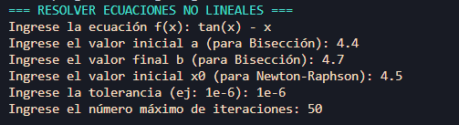
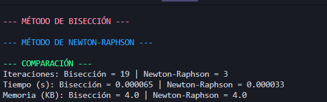
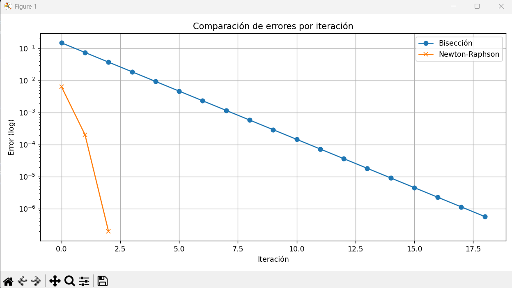

# 🧮 Resolución de Ecuaciones No Lineales con Bisección y Newton-Raphson

Este es un programa desarrollado en **Python puro** que permite resolver **ecuaciones no lineales** utilizando dos métodos numéricos:

- Método de **Bisección**
- Método de **Newton-Raphson**

Además de resolver la ecuación, compara ambos métodos en cuanto a:
- Número de iteraciones
- Tiempo de ejecución
- Memoria utilizada
- Y muestra una **gráfica comparativa de convergencia**

> ⚙️ Ejecutado completamente en la **terminal**. No requiere navegador web.

---

Instala las dependencias necesarias:

```bash
pip install sympy numpy matplotlib memory_profiler colorama

```
### ▶️ Cómo Ejecutar
Desde terminal (cmd, PowerShell, bash, etc):

```bash
python main.py
```

## 🧑‍💻 Ingreso de Datos
Cuando ejecutes el programa, te pedirá:

Una ecuación f(x) (en notación de Python).

Intervalo [a, b] para Bisección.

Valor inicial x0 para Newton-Raphson.

Tolerancia (ej. 1e-6) — qué tan cerca debe estar del resultado exacto.

Máximo de iteraciones permitidas.


## ℹ️ ¿Cómo escribir la ecuación?
Utiliza sintaxis de Python para las funciones. Ejemplos válidos:


####  Escribes en consola	        

- x**3 - 4*x + 1	               

-  cos(x) - x	                   

- x * exp(x) - 1	               

- log(x) - 2	                   

- sqrt(x) - 3


### ✅ Ejemplos ya resueltos

🔹 Ejemplo 1

```
Ingrese la ecuación f(x): x**3 - 4*x + 1


Ingrese el valor inicial a (para Bisección): -2

Ingrese el valor final b (para Bisección): 3

Ingrese el valor inicial x0 (para Newton-Raphson): 1

Ingrese la tolerancia (ej: 1e-6): 1e-6

Ingrese el número máximo de iteraciones: 50
```

🔹 Ejemplo 2

```
Ingrese la ecuación f(x): cos(x) - x

Ingrese el valor inicial a (para Bisección): 0

Ingrese el valor final b (para Bisección): 1

Ingrese el valor inicial x0 (para Newton-Raphson): 0.5

Ingrese la tolerancia (ej: 1e-6): 1e-6

Ingrese el número máximo de iteraciones: 50
```

## 📊 Tabla de Ejercicios Funcionales para Resolver

	Ecuación f(x)	  Intervalo [a, b] (Bisección)	    x0 (Newton-Raphson)	

```
1	x**3 - 4*x + 1	        [0, 1]	                       0.5	

2	cos(x) - x	            [0, 1]	                       0.5


3	x**2 - 2	            [1, 2]	                       1.5	

4	x**3 - x - 2	        [1, 2]	                       1.5

5	exp(x) - 2	            [0, 1]                         0.5	

6	x**3 + x - 1	        [0, 1]                         0.7	

7	log(x + 2) - 1	        [0, 1]                         0.5	

8	x*sin(x) - 1	        [1, 2]                         1.5	

9	x**4 - 16	            [1, 3]	                       2	

10	tan(x) - x	            [4.4, 4.7]	                   4.5

```
## 📘 ¿Qué es la tolerancia?
La tolerancia es el margen de error aceptable.
Por ejemplo, 1e-6 significa que el método se detendrá cuando la solución esté a menos de 0.000001 del valor real.

Mientras menor sea, más precisa será la respuesta, pero tardará más y usará más memoria.

## 📊 Resultado esperado
Se imprimirá en consola los resultados de ambos métodos.

Se resaltarán errores o advertencias si ocurren.

Se abrirá una gráfica comparativa que muestra la convergencia (error vs iteraciones).

## 📌 SALIDA DE CONSOLA 1.



## 📌 SALIDA DE CONSOLA 2.



## 📌 SALIDA DE CONSOLA 3.




## 🧠 ¿Cómo fue desarrollado?
Lenguaje: Python puro

Sin frameworks web.

Librerías utilizadas:

sympy para análisis simbólico y derivación automática

numpy para funciones matemáticas avanzadas

matplotlib para graficar

memory_profiler para medir memoria usada

colorama para dar color a la terminal

# 👤 Autor
Desarrollado por BREYNNER JOSE SIERRA ARIAS
Proyecto educativo para métodos numéricos y visualización de algoritmos iterativos.